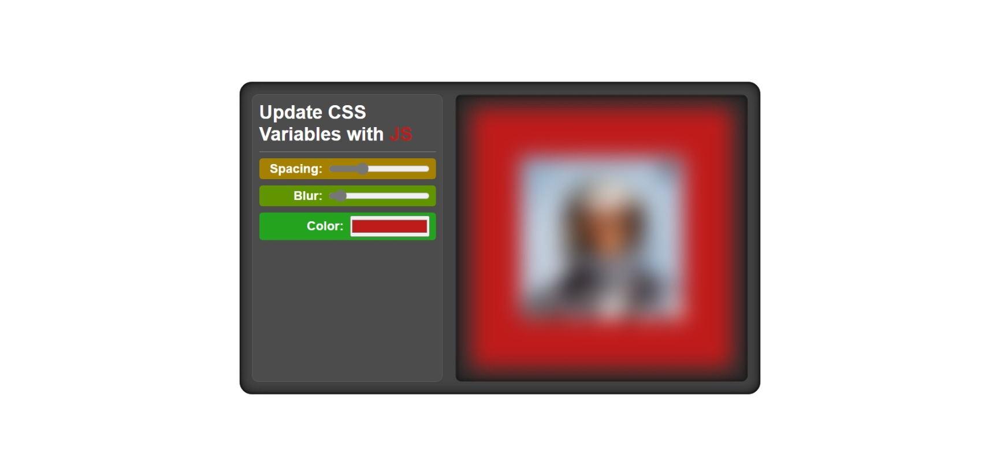

# JavaSrcipt30 (Build An App With Changeable CSS Variables)

This is my code of the "Build An App With Changeable CSS Variables" tutorial of JavaScript30.

## Table of contents

- [Overview](#overview)
  - [The challenge](#the-challenge)
  - [Screenshot](#screenshot)
  - [Links](#links)
- [My process](#my-process)
  - [Built with](#built-with)
- [Author](#author)

## Overview

### The challenge

Build An App With Changeable CSS Variables:
- app should have a range input which changes the padding of an image in real-time.
- app should have a range input which changes the blur filter of an image in real-time;
- app should be able to change the color of the background.

### Screenshot

-Desktop

-Mobile

### Links

- Live Site: ---> [LINK]()

## My process

### Built with

- Semantic HTML5 markup
- CSS custom properties
- Javascript

## Author

- Twitter - [@godking_jay](https://www.twitter.com/godking_jay)